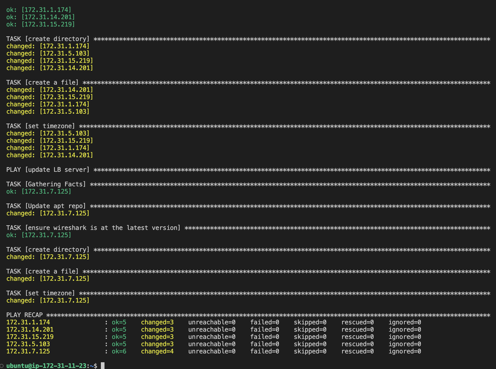
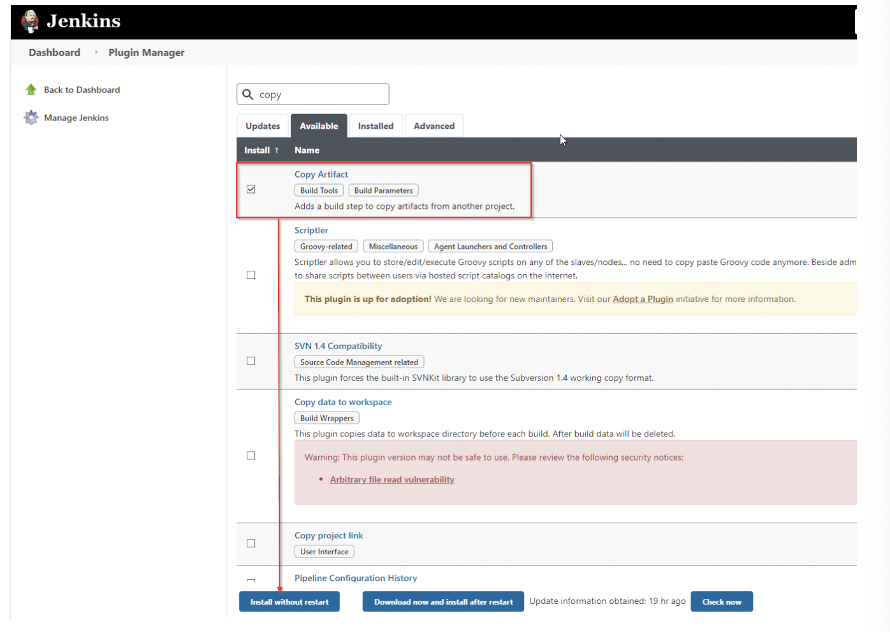
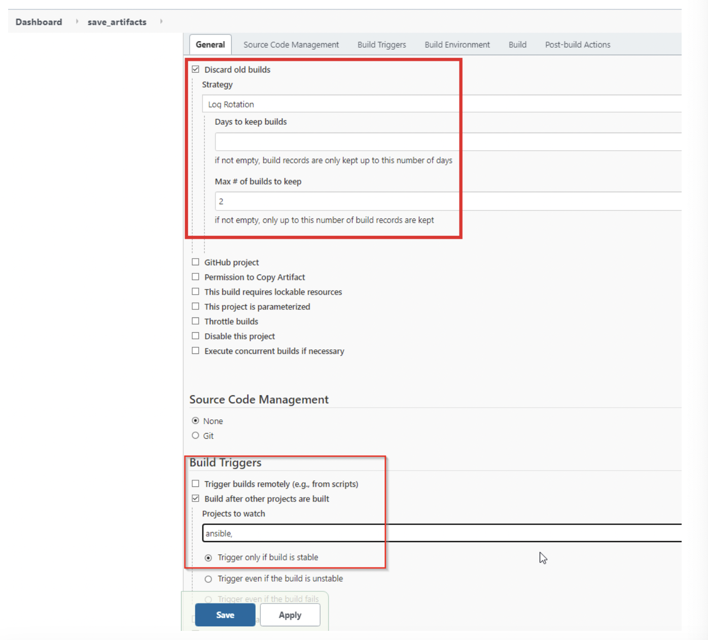
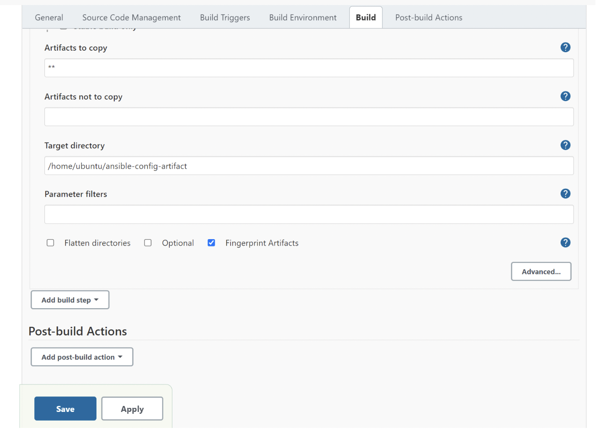
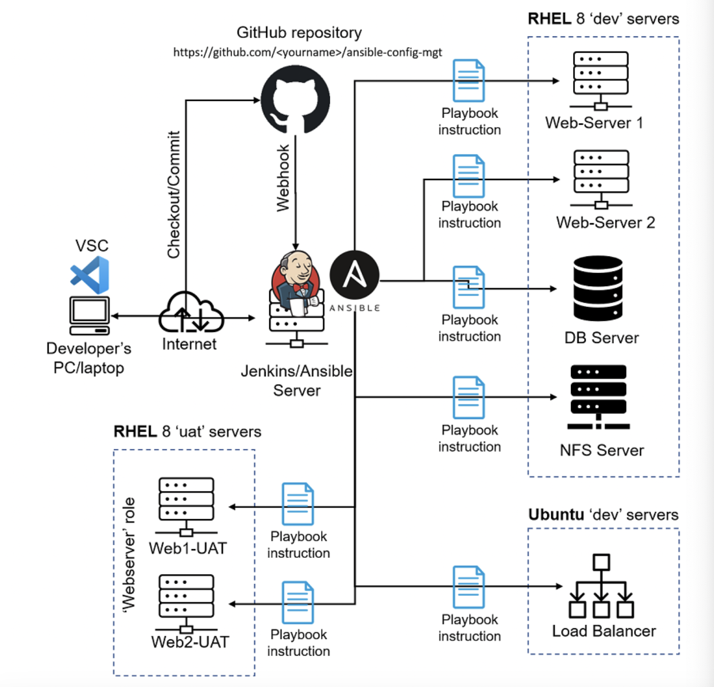

# ansible-conf-mangt-P11
**ANSIBLE CONFIGURATION MANAGEMENT – AUTOMATE PROJECT 7 TO 10**

### Ansible Client as a Jump Server (Bastion Host)

- A Jump Server (sometimes also referred as Bastion Host) is an intermediary server through which access to internal network can be provided. For instance, the current architecture i am  working on, ideally, the webservers would be inside a secured network which cannot be reached directly from the Internet. That means, even DevOps engineers cannot SSH into the Web servers directly and can only access it through a Jump Server – it provide better security and reduces attack surface.

- On the diagram below the Virtual Private Network (VPC) is divided into two subnets – Public subnet has public IP addresses and Private subnet is only reachable by private IP addresses.


## TASK

1.  Install and configure Ansible client to act as a Jump Server/Bastion Host.

2. Create a simple Ansible playbook to automate servers configuration


### STEP1: INSTALL AND CONFIGURE ANSIBLE ON EC2 INSTANCE

1. Update Name tag on your Jenkins EC2 Instance to `Jenkins-Ansible`. We will use this server to run playbooks.

2. In your GitHub account create a new repository and name it ansible-config-mgt.

3. Install Ansible

```
sudo apt update

sudo apt install ansible
```

- Check your Ansible version by running `ansible --version`

4. Configure Jenkins build job to save your repository content every time you change it.

- Create a new Freestyle project `ansible` in Jenkins and point it to your ‘ansible-config-mgt’ repository.
- Configure `Webhook` in GitHub and set webhook to trigger ansible build.
- Configure a Post-build job to save all (**) files.

5. Test your setup by making some change in README.MD file in main branch and make sure that builds starts automatically and Jenkins saves the files (build artifacts) in following folder
`ls /var/lib/jenkins/jobs/ansible/builds/<build_number>/archive/`

- Now the setup looks like this;


Note; Every time you stop/start your Jenkins-Ansible server – you have to reconfigure GitHub webhook to a new IP address, in order to avoid it, it makes sense to allocate an Elastic IP to your Jenkins-Ansible server.(Refer to LB server in Project 10).

## STEP 2 – Prepare your development environment using Visual Studio Code

1. Intall Visual Studio Code, configure it to connect to your newly created GitHub repository.

2. Clone down your ansible-config-mgt repo to your Jenkins-Ansible instance
git clone <ansible-config-mgt repo link>


3. In your ansible-config-mgt GitHub repository, create a new branch that will be used for development of a new feature.

4. Checkout the newly created feature branch to your local machine and start building your code and directory structure there.

`git checkout -b Prj-11a`

5. Create a directory and name it playbooks – it will be used to store all your playbook files.

`mkdir palybooks`

6. Create a directory and name it inventory – it will be used to keep your hosts organised.

`mkdir inventory`

7. Within the playbooks folder, create your first playbook, and name it common.yml

`cd playbooks && touch common.yml`

8. Within the inventory folder, create an inventory file (.yml) for each environment (Development, Staging Testing and Production) dev, staging, uat, and prod respectively.


`cd inventory && touch dev.ym staging.yml hat.yml prod.yml`


## STEP 3 – Set up an Ansible Inventory

- An Ansible inventory file defines the hosts and groups of hosts upon which commands, modules, and tasks in a playbook operate.

- Save below inventory structure in the `inventory/dev.yml` file to start configuring your development servers. Ensure to replace the IP addresses according to your own setup.


- **Note:** Ansible uses TCP port 22 by default, which means it needs to ssh into target servers from Jenkins-Ansible host – for this can implement the concept of ssh-agent. 

You can enable this  SSH configuration file snippet for connecting to a remote server  with the Public IP address of "3.132.218.7" on your **IDE**

```
Host jenkins-ansible
    Hostname 3.132.218.7
    User ubuntu
    IdentityFile <path to key.pem file>(/Users/mozart/downloads/)MayorFaj-EC2.pem
    ForwardAgent yes
    ControlPath /tmp/ansible-ssh-%h-%p-%r
    ControlMaster auto
    ControlPersist 10m 
```
### **Here's what each line means:**

- **Host jenkins-ansible"** specifies the nickname or alias for the remote server that you want to connect to.
- **"Hostname 3.132.218.7"** specifies the IP address or domain name of the remote server.
- **"User ubuntu"** specifies the username that will be used to authenticate with the remote server.
- **"IdentityFile /Users/mozart/downloads/MayorFaj-EC2.pem"** specifies the path to the SSH private key that will be used to authenticate with the remote server.
**"ForwardAgent yes"** specifies that SSH agent forwarding should be enabled for this connection, allowing the user to use their local SSH keys to authenticate with other servers accessed from the remote server.
**"ControlPath /tmp/ansible-ssh-%h-%p-%r"** specifies the path to the control socket used for connection multiplexing.
**"ControlMaster auto"** specifies that connection multiplexing should be enabled for this connection.
**"ControlPersist 10m"** specifies that the master connection should remain active for up to 10 minutes after the last active session, allowing subsequent sessions to use the same master connection

- Now you need to import your key into ssh-agent.

```
eval `ssh-agent -s`
ssh-add <path-to-private-key>
```


- Confirm the key has been added with the command below, you should see the name of your key

`ssh-add -l`

- Now, ssh into your Jenkins-Ansible server using ssh-agent

`ssh -A ubuntu@public-ip`


- Update your inventory/dev.yml file with this snippet of code:

```
[nfs]
<NFS-Server-Private-IP-Address> ansible_ssh_user='ec2-user'

[webservers]
<Web-Server1-Private-IP-Address> ansible_ssh_user='ec2-user'
<Web-Server2-Private-IP-Address> ansible_ssh_user='ec2-user'

[db]
<Database-Private-IP-Address> ansible_ssh_user='ec2-user' 

[lb]
<Load-Balancer-Private-IP-Address> ansible_ssh_user='ubuntu'
```

## STEP 4 – Create a Common Playbook

- It is time to start giving Ansible the instructions on what you needs to be performed on all servers listed in inventory/dev

- In common.yml playbook you will write configuration for repeatable, re-usable, and multi-machine tasks that is common to systems within the infrastructure

- Update your playbooks/common.yml file with following code:

```
---
- name: update web, nfs and db servers
  hosts: webservers, nfs, db
  remote_user: ec2-user
  become: yes
  become_user: root
  tasks:
    - name: ensure wireshark is at the latest version
      yum:
        name: wireshark
        state: latest

# ---------------------------------------------------------------------

- name: update LB server
  hosts: lb
  remote_user: ubuntu
  become: yes
  become_user: root
  tasks:
    - name: Update apt repo
      apt: 
        update_cache: yes

    - name: ensure wireshark is at the latest version
      apt:
        name: wireshark
        state: latest
...
```

- ###  This playbook is divided into two parts, each of them is intended to perform the same task: install wireshark utility (or make sure it is updated to the latest version) on your RHEL 8 and Ubuntu servers. It uses root user to perform this task and respective package manager: yum for RHEL 8 and apt for Ubuntu.


## STEP 5 – Update GIT with the latest code

- Now all of your directories and files live on your machine and you need to push changes made locally to GitHub.

- We have a separate branch, there is need to  raise a `Pull Request` (PR), get your branch peer reviewed and merged to the main branch.

- Commit your code into GitHub:

1. Use git commands to add, commit and push your branch to GitHub.

```
git status

git add <selected files>

git commit -m "commit message"

```

2. Head to your github account, create a Pull request 

3. Review the code, and merge to the main branch.

4. Head back on your terminal, checkout from the feature branch into the main, and pull down the latest changes.

`git checkout main`

`git pull origin prj-11a`

- Once your code changes appear in main branch – Jenkins will do its job and save all the files (build artifacts) to `/var/lib/jenkins/jobs/ansible/builds/<build_number>/archive/` directory on `Jenkins-Ansible server`.


## STEP 7 – Run Ansible test

- Execute ansible-playbook command . On your jenkins-ansible server termianl, run

`ansible-playbook -i /var/lib/jenkins/jobs/ansible/builds/<buildnumber>/archive/inventory/dev.yml /var/lib/jenkins/jobs/ansible/builds/<buildnumber>/archive/playbooks/common.yml`


- You can go to each of the servers and check if wireshark has been installed by running `which wireshark` or `wireshark --version`


- The updated Ansible architecture now looks like this:


### Optional Step

- Update your ansible playbook with some new Ansible tasks and go through the full

`checkout -> change codes -> commit -> PR -> merge -> build -> ansible-playbook`

cycle again to see how easily you can manage a servers fleet of any size with just one command!

- Update this playbook with following tasks:

1. Create a directory and a file inside it
2. Change timezone on all servers
3. Run some shell script
4. ...


```
---
- name: update web, nfs and db servers
  hosts: webservers, nfs, db
  remote_user: ec2-user
  become: yes
  become_user: root
  tasks:
    - name: ensure wireshark is at the latest version
      yum:
        name: wireshark
        state: latest

    - name: create directory
      file:
        path: /home/mydir
        state: directory
    
    - name: create a file
      file:
        path: /home/mydir/file.txt
        state: touch

    - name: set timezone
      timezone:
        name: America/New_York
# ------------------------------------------------------------------
- name: update LB server
  hosts: lb
  remote_user: ubuntu
  become: yes
  become_user: root
  tasks:
    - name: Update apt repo
      apt: 
        update_cache: yes

    - name: ensure wireshark is at the latest version
      apt:
        name: wireshark
        state: latest

    - name: create directory
      file:
        path: /home/mydir
        state: directory
    
    - name: create a file
      file:
        path: /home/mydir/file.txt
        state: touch

    - name: set timezone
      timezone:
        name: America/New_York
...


```

 


# **THANKS!!!**


# PROJECT-12

# ANSIBLE REFACTORING AND STATIC ASSIGNMENTS (IMPORTS AND ROLES)

- Make some improvements to the code, refactor the ansible code, create assignments , and use iports functionality.
**Imports** allow to effectively re-use previously created playbooks in a new playbook. it allows to organize your tasks and reuse them when needed.

### Code Refactoring

- Refactoring is a general term in computer programming. It means making changes to the source code without changing expected behaviour of the software. The main idea of refactoring is to enhance code readability, increase maintainability and extensibility, reduce complexity, add proper comments without affecting the logic


### Step 1 – Jenkins job enhancement

- Before we begin, let us make some changes to our Jenkins job – now every new change in the codes creates a separate directory which is not very convenient when we want to run some commands from one place. Besides, it consumes space on Jenkins server with each subsequent change. Let us enhance it by introducing a new Jenkins project/job – we will require `Copy Artifact` plugin.

1. Go to your Jenkins-Ansible server and create a new directory called ansible-config-artifact – we will store there all artifacts after each build.

`sudo mkdir /home/ubuntu/ansible-config-artifact`

2. Change permissions to this directory, so Jenkins could save files there – `chmod -R 0777 /home/ubuntu/ansible-config-artifact`

3. Go to Jenkins web console -> Manage Jenkins -> Manage Plugins -> on Available tab search for `Copy Artifact` and install this plugin without restarting Jenkins.



4. Create a new Freestyle project and name it `save_artifacts`

5. This project will be triggered by completion of your existing `ansible` project. Configure it accordingly



**Note:** You can configure number of builds to keep in order to save space on the server, for example, you might want to keep only last 2 or 5 build results. You can also make this change to your `ansible` job.

6. The main idea of `save_artifacts` project is to save artifacts into `/home/ubuntu/ansible-config-artifact` directory. To achieve this, create a `Build step` and choose `Copy artifacts from other project`, specify `ansible` as a source project and `/home/ubuntu/ansible-config-artifact` as a target directory.



7. Test your set up by making some change in README.MD file inside your `ansible-config-mgt` repository (right inside main branch).

If both Jenkins jobs have completed one after another – you shall see your files inside `/home/ubuntu/ansible-config-artifact` directory and it will be updated with every commit to your `main` branch.

Now your Jenkins pipeline is more neat and clean.

## Step 2 – Refactor Ansible code by importing other playbooks into `site.yml`

- Breaking tasks up into different files is an excellent way to organize complex sets of tasks and reuse them.

- Before starting to refactor the codes, ensure that you have pulled down the latest code from master (main) branch, and created a new branch, name it refactor.

1. Within `playbooks` folder, create a new file and name it `site.yml` – This file will now be considered as an entry point into the entire infrastructure configuration. Other playbooks will be included here as a reference. In other words, `site.yml` will become a parent to all other playbooks that will be developed. Including common.yml that was created previously.

2. Create a new folder in root of the repository and name it `static-assignments`. The **static-assignments** folder is where all other children playbooks will be stored. This is merely for easy organization of your work. It is not an Ansible specific concept, therefore you can choose how you want to organize your work.

3. Move `common.yml` file into the newly created `static-assignments` folder.

4. Inside `site.yml` file, import `common.yml` playbook.

```
---
- hosts: all
- import_playbook: /home/ubuntu/ansible-conf-mangt/static-assignments/common.yml
```

The code above uses built in `import_playbook` Ansible module.

Your folder structure should look like this;

```
├── static-assignments
│   └── common.yml
├── inventory
    └── dev
    └── stage
    └── uat
    └── prod
└── playbooks
    └── site.yml
```


5. Run ansible-playbook command against the dev environment

Since you need to apply some tasks to your dev servers and `wireshark` is already installed – you can go ahead and create another playbook under `static-assignments` and name it `common-del.yml`. In this playbook, configure deletion of `wireshark` utility.

```
---
- name: delete wireshark on Ubuntu and RHEL
  hosts: all
  become: yes
  become_user: root
  tasks:
    - name: delete wireshark on ubuntu
      when: ansible_os_family == 'Debian'
      apt:
        name: wireshark
        state: absent
        autoremove: yes
        purge: yes
        autoclean: yes

    - name: delete wireshark on Red Hat
      when: ansible_os_family == 'RedHat'
      yum:
        name: wireshark
        state: absent
...
```

# **OR**

```
---
- name: update web, nfs and db servers
  hosts: webservers, nfs, db
  remote_user: ec2-user
  become: yes
  become_user: root
  tasks:
  - name: delete wireshark
    yum:
      name: wireshark
      state: removed

#-------------------------------------------------
- name: update LB server
  hosts: lb
  remote_user: ubuntu
  become: yes
  become_user: root
  tasks:
  - name: delete wireshark
    apt:
      name: wireshark-qt
      state: absent
      autoremove: yes
      purge: yes
      autoclean: yes
...

```


update `site.yml` with - `import_playbook:` `/home/ubuntu/ansible-conf-mangt/static-assignments/common-del.yml` instead of `common.yml` and run it against `dev` servers:

```
cd /home/ubuntu/ansible-config-mgt/

ansible-playbook -i inventory/dev.yml playbooks/site.yaml
```


Make sure that `wireshark` is deleted on all the servers by running `wireshark --version`

## Step 3 – Configure UAT Webservers with a role ‘Webserver’

We could write tasks to configure Web Servers in the same playbook, but it would be too messy, instead, we will use a dedicated role to make our configuration reusable.


1. Launch 2 fresh EC2 instances using RHEL 8 image, we will use them as our `uat` servers, so give them names accordingly – `Web1-UAT` and `Web2-UAT`

2. To create a role, you must create a directory called `roles/`, relative to the playbook file or in `/etc/ansible/` directory.

There are two ways how you can create this folder structure:

- Use an Ansible utility called `ansible-galaxy` inside `ansible-conf-mangt-P11/roles` directory (you need to create roles directory upfront)

```
mkdir roles
cd roles
ansible-galaxy init webserver
```

- Create the directory/files structure manually

The entire folder structure should look like below, but if you create it manually – you can skip creating tests, files, and vars or remove them if you used ansible-galaxy

```
└── webserver
    ├── README.md
    ├── defaults
    │   └── main.yml
    ├── files
    ├── handlers
    │   └── main.yml
    ├── meta
    │   └── main.yml
    ├── tasks
    │   └── main.yml
    ├── templates
    ├── tests
    │   ├── inventory
    │   └── test.yml
    └── vars
        └── main.yml
```


After removing unnecessary directories and files, the roles structure should look like this

```
└── webserver
    ├── README.md
    ├── defaults
    │   └── main.yml
    ├── handlers
    │   └── main.yml
    ├── meta
    │   └── main.yml
    ├── tasks
    │   └── main.yml
    └── templates
```


3. Update your inventory ansible-conf-mangt-P11/inventory/uat.yml file with IP addresses of your 2 UAT Web servers

```
[uat-webservers]
<Web1-UAT-Server-Private-IP-Address> ansible_ssh_user='ec2-user' 

<Web2-UAT-Server-Private-IP-Address> ansible_ssh_user='ec2-user'
```

**NOTE:** Ensure you are using ssh-agent to ssh into the Jenkins-Ansible instance.

4. In `/etc/ansible/ansible.cfg` file uncomment `roles_path` string and provide a full path to your roles directory `roles_path    = /home/ubuntu/ansible-config-mgt/roles`, so Ansible could know where to find configured roles.

5. It is time to start adding some logic to the webserver role. Go into `tasks` directory, and within the `main.yml` file, start writing configuration tasks to do the following:

- Install and configure Apache (httpd service)

- Clone Tooling website from GitHub https://github.com/<your-name>/tooling.git.

- Ensure the tooling website code is deployed to /var/www/html on each of 2 UAT Web servers.

- Make sure httpd service is started

Your main.yml may consist of following tasks:

```
---
- name: install apache
  become: true
  ansible.builtin.yum:
    name: "httpd"
    state: present

- name: install git
  become: true
  ansible.builtin.yum:
    name: "git"
    state: present

- name: clone a repo
  become: true
  ansible.builtin.git:
    repo: https://github.com/<your-name>/tooling.git
    dest: /var/www/html
    force: yes

- name: copy html content to one level up
  become: true
  command: cp -r /var/www/html/html/ /var/www/

- name: Start service httpd, if not started
  become: true
  ansible.builtin.service:
    name: httpd
    state: started

- name: recursively remove /var/www/html/html/ directory
  become: true
  ansible.builtin.file:
    path: /var/www/html/html
    state: absent
```

### Step 4 – Reference ‘Webserver’ role

Within the `static-assignments` folder, create a new assignment for uat-webservers `uat-webservers.yml`. This is where you will reference the role.

```
---
- hosts: uat-webservers
  roles:
     - webserver
```

Remember that the entry point to our ansible configuration is the `site.yml` file. Therefore, you need to refer your `uat-webservers.yml` role inside `site.yml`.

So, we should have this in `site.yml`

```
---
- hosts: all
- import_playbook: ../static-assignments/common.yml

- hosts: uat-webservers
- import_playbook: ../static-assignments/uat-webservers.yml
```

### Step 5 – Commit & Test

Commit your changes, create a Pull Request and merge them to master branch, make sure webhook triggered two consequent Jenkins jobs, they ran successfully and copied all the files to your Jenkins-Ansible server into `/home/ubuntu/ansible-config-mgt/` directory.

Now run the playbook against your uat inventory and see what happens:

`sudo ansible-playbook -i /home/ubuntu/ansible-config-mgt/inventory/uat.yml /home/ubuntu/ansible-config-mgt/playbooks/site.yaml`

You should be able to see both of your UAT Web servers configured and you can try to reach them from your browser:

`http://<Web1-UAT-Server-Public-IP-or-Public-DNS-Name>/index.php`

or

`http://<Web1-UAT-Server-Public-IP-or-Public-DNS-Name>/index.php`

Your Ansible architecture now looks like this:




# **THANKS!!!**
